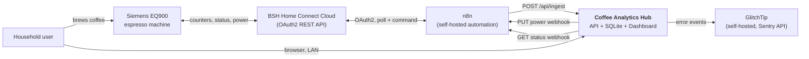
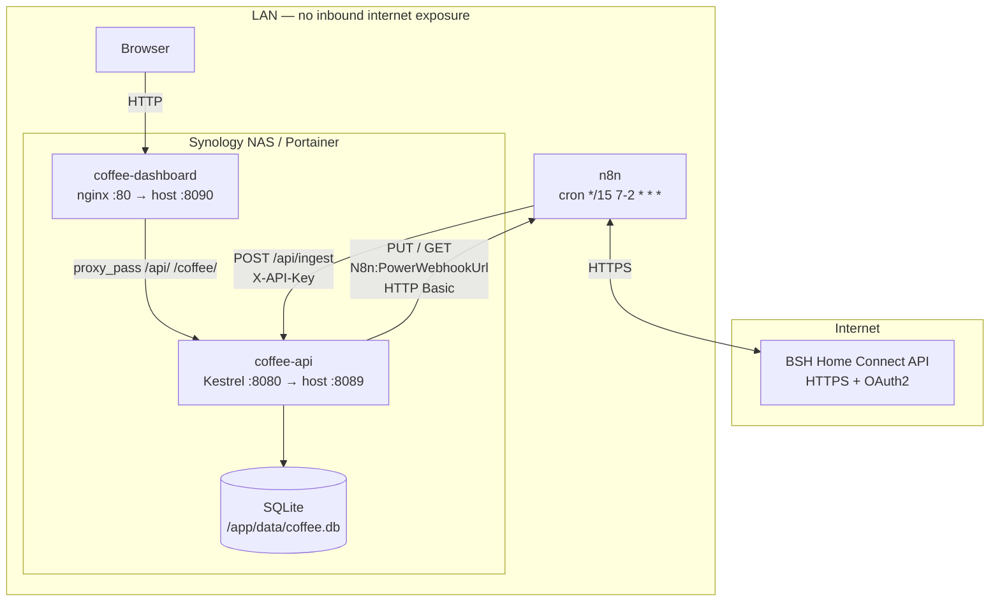

# 3. System Context and Scope

## 3.1 Business Context

| Partner | Gives the system | Receives from the system |
|---------|------------------|--------------------------|
| **Household user** | Annotations (mass-import / event), power commands, time-range selections | Consumption charts, KPIs, heatmap, anomaly flags, live machine status |
| **n8n** | Home Connect status payloads every 15 min | Power commands to relay; ingest acknowledgements (201/200) |
| **BSH Home Connect** | Machine counters and operation state (via n8n) | Power on/off commands (via n8n) |
| **GlitchTip** | — | Unhandled exceptions and frontend errors, stripped of PII |

**Explicitly out of scope:** brew programs, recipes, water hardness, descaling
schedules, milk system cleaning, multi-machine fleets, user accounts.

## 3.2 Technical Context

### Interface catalogue

| # | Interface | Direction | Protocol | Auth | Defined in |
|---|-----------|-----------|----------|------|------------|
| I-1 | Snapshot ingest | n8n → API | `POST /api/ingest`, JSON | `X-API-Key` header | `IngestController`, `ApiKeyMiddleware` |
| I-2 | Statistics read | Dashboard → API | `GET /api/stats`, `/api/stats/daily/{date}`, `/api/stats/range`, `/api/stats/heatmap` | none (LAN) | `StatsController` |
| I-3 | Day annotations | Dashboard → API | `GET`/`POST`/`DELETE /api/stats/marked-days` | none (LAN) | `MarkedDaysController` |
| I-4 | Power command | Dashboard → API | `POST /coffee/power`, `{ "state": "on"\|"off" }`, 10 requests per minute | `X-API-Key` header | `PowerController` |
| I-5 | Power relay | API → n8n | `PUT <N8n:PowerWebhookUrl>`, `{ "state": "on"\|"off" }` | HTTP Basic (optional) | `HomeConnectService` |
| I-6 | Status relay | API → n8n | `GET <N8n:PowerWebhookUrl>`, 5 s timeout | HTTP Basic (optional) | `HomeConnectService` |
| I-7 | Live status | Dashboard → API | `GET /coffee/status`, 7 s server-side cache | none (LAN) | `CoffeeStatusController` |
| I-8 | Health | any → API | `GET /api/health` | none | `StatsController.Health` |
| I-9 | API documentation | Browser → API | `GET /scalar/v1`, `GET /openapi/v1.json` — `Development` only, not proxied by nginx | none | `Program.cs` (Scalar) |
| I-10 | Error reporting | API + Dashboard → GlitchTip | Sentry protocol over HTTPS | DSN | `Program.cs`, `src/lib/sentry.ts` |

The full request/response contract lives in `SPEC.md`; the OpenAPI document is
generated at runtime and served at `/openapi/v1.json` when the API runs in
`Development`.

## 3.3 Data Flows

### 3.3.1 Ingest flow (n8n → API → SQLite)

1. n8n's cron trigger fires (`*/15 7-2 * * *` — every 15 minutes between 07:00
   and 02:59; a coffee machine at 04:00 is not interesting enough to spend
   quota on).
2. n8n reads the current machine status from Home Connect using its stored
   OAuth2 token, refreshing the token when needed.
3. n8n POSTs the **raw, untransformed** Home Connect payload to
   `http://<NAS-IP>:8089/api/ingest` (or `http://coffee-api:8080/api/ingest`
   when it shares the Docker network) with the `X-API-Key` header.
4. `ApiKeyMiddleware` validates the key in constant time.
5. `IngestController` rejects a payload without `data.status` entries (400).
6. `SnapshotService.MapToEntity` translates Home Connect keys
   (`ConsumerProducts.CoffeeMaker.Status.BeverageCounterCoffee`, …) into
   entity properties and stamps `Timestamp = DateTime.UtcNow`.
7. The idempotency check compares the new counters against the latest stored
   snapshot for the same `MachineId`.
8. **Counters increased** → row inserted, `201 Created`.
   **Otherwise** → nothing written, `200 OK` with `created: false`.

> The payload's own timestamp is not used; the server's receive time is
> authoritative. See [ADR-009](09-design.md#adr-009-server-side-ingest-timestamp).

### 3.3.2 Read flow (Dashboard → API → SQLite)

1. The browser computes its UTC offset once per module load
   (`-new Date().getTimezoneOffset()`) and appends it as `tz=<minutes>`.
2. TanStack Query calls the relevant `GET /api/stats/*` endpoint; nginx
   proxies it to the API container.
3. The API converts the requested local date(s) into a UTC half-open interval,
   loads the snapshots, and computes deltas — including a baseline snapshot
   from *before* the interval so the first delta of the period is correct.
4. Recharts renders; TanStack Query caches so navigating between pages does
   not re-fetch.

### 3.3.3 Power control flow (Dashboard → API → n8n → BSH)

1. The dashboard checks the UI-side time lock (`coffeeAllowed()`: 07:00–18:00
   Europe/Berlin) and disables the button outside that window.
2. `POST /coffee/power` with `{ "state": "on" }`.
3. `PowerController` validates the literal against `"on"` / `"off"` and
   delegates to `HomeConnectService.SetPowerStateAsync`.
4. The service PUTs to the configured n8n webhook, optionally with HTTP Basic
   credentials, and throws on a non-success status.
5. n8n relays the command to Home Connect.
6. On success the dashboard waits ~3 s for BSH to settle, then invalidates the
   status query.

> The time lock is **UI-only**. The API enforces nothing — see
> [11](11-risks.md).

### 3.3.4 Status flow (Dashboard → API → n8n)

`GET /coffee/status` returns a cached `CoffeeStatusDto` for 7 seconds. On a
cache miss the API GETs the n8n webhook with a 5-second timeout. Any failure —
timeout, non-2xx, unparsable body — is mapped to a *successful* response with
`reachable: false` and a German label (`"Offline"`), so the dashboard renders a
degraded state instead of an error.
