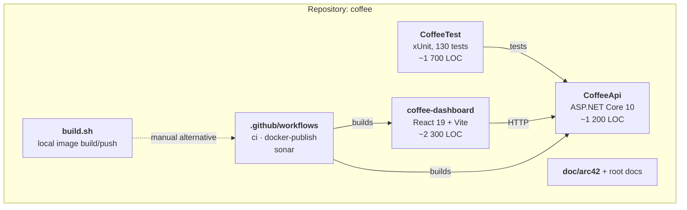
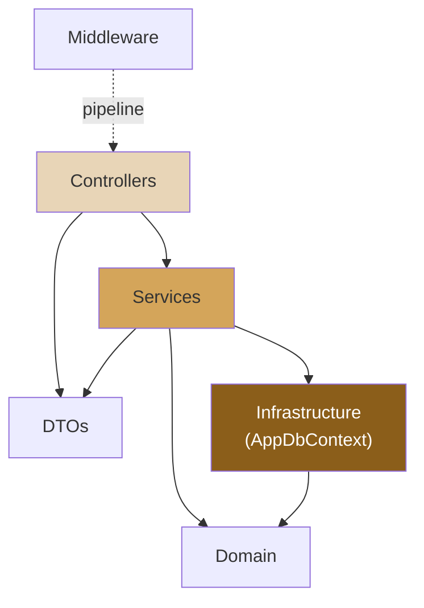
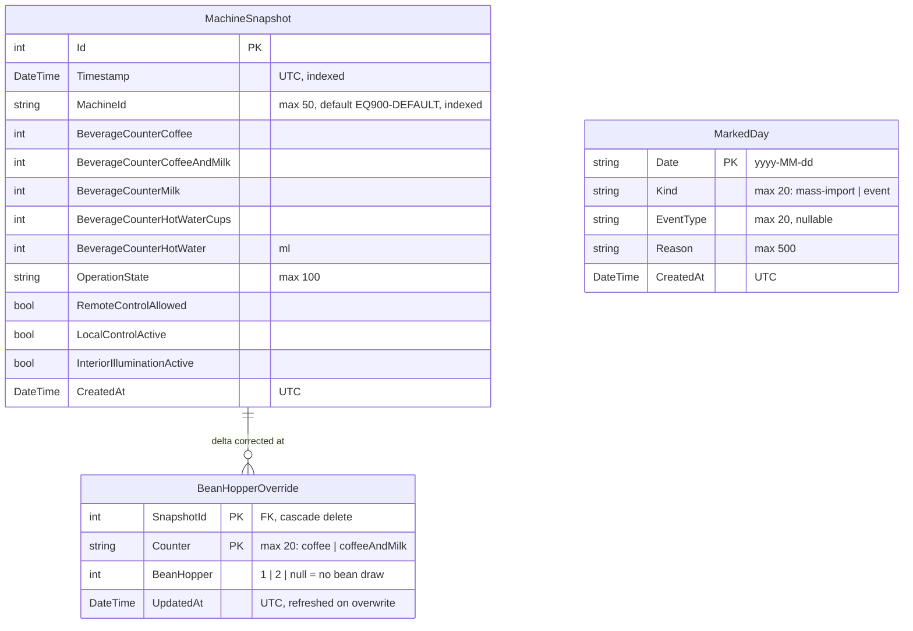
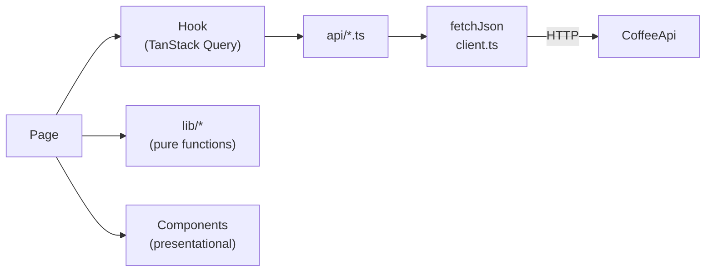

# 5. Building Block View

## 5.1 Level 1 — System Decomposition



| Building block | Responsibility | Key interfaces |
|----------------|----------------|----------------|
| **CoffeeApi** | Ingest, persistence, statistics, day annotations, power relay, health | HTTP (see [03.2](03-context.md#interface-catalogue)) |
| **CoffeeTest** | Unit, controller, and integration tests | References `CoffeeApi` |
| **coffee-dashboard** | Visualisation and user interaction | Consumes the API; served by nginx |
| **.github/workflows** | Build, test, image publish, static analysis | GitHub Actions |
| **build.sh** | Manual Podman/Docker build + push to GHCR | Local operator tooling |
| **doc/** + root markdown | Architecture, API contract, design language, conventions | — |

## 5.2 Level 2 — CoffeeApi

```
CoffeeApi/
├── Program.cs                       # composition root: Sentry, DI, CORS, pipeline, migrate
├── Controllers/
│   ├── IngestController.cs          # POST   /api/ingest
│   ├── StatsController.cs           # GET    /api/stats, /daily/{date}, /range, /heatmap, /api/health
│   ├── MarkedDaysController.cs      # GET/POST/DELETE /api/stats/marked-days
│   ├── BeanHoppersController.cs     # POST/DELETE /api/stats/snapshots/{id}/bean-hopper
│   ├── PowerController.cs           # POST   /coffee/power
│   └── CoffeeStatusController.cs    # GET    /coffee/status
├── Services/
│   ├── ISnapshotQueryService.cs / SnapshotQueryService.cs        # which rows?
│   ├── ISnapshotIngestService.cs / SnapshotIngestService.cs      # idempotency + persistence
│   ├── ISnapshotStatisticsService.cs / …StatisticsService.cs     # summary, range, heatmap
│   ├── SnapshotPayloadMapper.cs                      # Home Connect payload → entity
│   ├── IMarkedDayService.cs / MarkedDayService.cs    # annotation rules + persistence
│   ├── IBeanHopperService.cs / BeanHopperService.cs  # bean-hopper rules + overrides
│   ├── IHomeConnectService.cs / HomeConnectService.cs# n8n webhook client
│   └── IngestWatchdog.cs                             # alarms when the ingest stops
├── Domain/
│   ├── MachineSnapshot.cs           # counters + status at a point in time
│   ├── MarkedDay.cs                 # per-date annotation
│   ├── BeanCounters.cs              # which counters draw beans, and from which hopper
│   ├── BeanHopperOverride.cs        # manual correction per (snapshot, counter)
│   └── LocalDay.cs                  # the one definition of the local-day rule
├── DTOs/                            # request/response contracts, no entities on the wire
├── Infrastructure/
│   ├── AppDbContext.cs              # EF Core model, indexes, UTC value converter
│   ├── DesignTimeDbContextFactory.cs# lets `dotnet ef` build a context without the host
│   └── MigrationBaseliner.cs        # pre-migration DB compatibility
├── Middleware/
│   └── ApiKeyMiddleware.cs          # X-API-Key on ingest + writes
└── Migrations/                      # Initial, AddExcludedDays, RenameExcludedDaysToMarkedDays,
                                     # DropUnusedIdempotencyIndex, AddBeanHopperOverrides
```

### 5.2.1 Layer dependencies



No controller reaches past the service layer; the range aggregation that used
to sit in `StatsController` moved into `SnapshotStatisticsService` (ADR-012).

### 5.2.2 White box: the snapshot services

Five concerns, five types — cut along the reason to change (ADR-012):

| Type | Members | Notes |
|------|---------|-------|
| `LocalDay` | `BoundsUtc`, `ToLocal`, `DateOf` | Local date + offset → half-open UTC interval. The single definition of the day rule |
| `SnapshotPayloadMapper` | `Map` | Maps Home Connect key strings to entity properties; tolerates `JsonElement`, boxed primitives, and strings. Pure — the caller supplies the timestamp |
| `SnapshotQueryService` | `GetLatestAsync`, `GetAllAsync`, `GetByDateAsync`, `GetByDateRangeAsync`, `GetSinceAsync`, `GetLastSnapshotBeforeAsync`, `IsDatabaseReachableAsync` | `GetAllAsync` caps `pageSize` at 100 |
| `SnapshotIngestService` | `ProcessIngestAsync`, `HasCounterIncreased` | Idempotency gate; returns `(Created, Snapshot)` |
| `SnapshotStatisticsService` | `GetDailySummaryAsync`, `GetRangeAggregateAsync`, `GetHeatmapDataAsync` | Delta computation, peak-hour detection, mass-import exclusion |

`SnapshotStatisticsService.GetDailySummaryAsync` in detail:

1. Load the day's snapshots (timezone-aware bounds).
2. Empty → return a zeroed `DailySummaryDto`.
3. Load the last snapshot strictly before the day → `baseline`
   (fallback: the day's own first snapshot).
4. `coffeeToday = last.Coffee − baseline.Coffee`;
   `milkDrinksToday = Δ(CoffeeAndMilk) + Δ(Milk)`. All results clamped at ≥ 0.
5. Walk the sequence `[baseline?] + daySnapshots` pairwise; the largest
   positive `ΔTotalBeverages` determines `PeakHour`, reported in the caller's
   local time.

`SnapshotStatisticsService.GetHeatmapDataAsync` in detail:

1. Load all snapshots newer than `UtcNow − 7·weeks` days.
2. Load the set of `mass-import` dates.
3. Walk pairwise; for each positive delta, shift the *later* timestamp into
   client-local time, skip it when its local date is a mass-import day, and
   accumulate into a `(dayOfWeek, hour)` bucket.
4. `DayOfWeek` is emitted ISO-8601 style — Monday = 1 … Sunday = 7.

`GetRangeAggregateAsync` groups the range by client-local date, seeds the
first day from the last snapshot before the range, and rolls the baseline
forward day by day. Same delta rule as the daily summary, applied per day.

> The heatmap window is a rolling `weeks × 7` days measured from *now* in UTC,
> not aligned to local week boundaries.

### 5.2.3 White box: other API components

**`IngestController`** — Rejects payloads whose `data.status` is null or
empty (400). Delegates to `SnapshotIngestService`. `201 Created` with a `Location`
of `/api/stats/{id}` when a row was written, `200 OK` when the payload carried
no counter increase. Unexpected exceptions are logged and answered with a
generic 500 body.

**`StatsController`** — Read-only endpoints plus `/api/health`. Validates
`page ≥ 1` and `pageSize ≥ 1`, then caps `pageSize` at 100. `GetDaily`
prepends the previous day's last snapshot to the returned snapshot list so the
frontend can compute the first hourly delta. `GetRange` validates the two
dates and hands the aggregation to `SnapshotStatisticsService`. `GetHeatmap`
caps `weeks` at 52.

**`MarkedDaysController`** — Thin. All validation lives in `MarkedDayService`,
which returns a `MarkedDayError` enum; the controller maps that enum to status
codes (400 / 404 / 409). `IsValidKind` is exposed on the service purely so the
`GET` filter parameter can be validated with the same vocabulary.

**`MarkedDayService`** — Owns the domain rules: date must parse as
`yyyy-MM-dd`; `kind ∈ {mass-import, event}` (defaults to `mass-import`);
`event` requires an `eventType` from a fixed set; `mass-import` requires a
non-empty reason; one annotation per date (conflict otherwise).

**`PowerController`** — Validates the state literal, delegates, maps
exceptions to a generic 500. No authentication, no server-side time window.

**`CoffeeStatusController`** — `IMemoryCache` in front of
`HomeConnectService.GetStatusAsync` with a 7-second TTL, sized to protect the
BSH quota against a user clicking refresh.

**`HomeConnectService`** — Typed `HttpClient`. Reads `N8n:PowerWebhookUrl` in
its constructor and throws if it is missing. Because a typed client is resolved
per request, that throw happens when a `/coffee/*` action is first activated,
**not** at startup: the application starts cleanly and the first status or
power request fails with 500. Attaches HTTP Basic credentials when configured. `SetPowerStateAsync`
propagates failures via `EnsureSuccessStatusCode`; `GetStatusAsync` swallows
every failure and returns an `Unreachable(...)` DTO instead.

**`IngestWatchdog`** — `BackgroundService`. Every `Watchdog:CheckIntervalMinutes`
it reads the newest snapshot and compares its age against
`Watchdog:StaleAfterMinutes`. The staleness rule itself is a pure function
(`IngestWatchdogEvaluator`), and the one-alarm-per-outage edge detection is a
separate state machine (`IngestWatchdogAlertState`) — both testable without a
clock or a database. The alarm channel is an `Error`-level log entry, which the
Sentry integration turns into a GlitchTip event; there is no second alerting
path to configure. A failing snapshot read logs a warning instead and does not
alarm: a broken database is not an ingest outage.

**`ApiKeyMiddleware`** — Path-prefix allowlist, method-aware: `/api/ingest` (all methods), `POST /coffee/power`, `POST` and `DELETE` on `/api/stats/marked-days` and `/api/stats/snapshots`. Reads on those paths are deliberately left open. With no
configured key it logs a warning and lets the request through — deliberate
development affordance, and a production risk if the key is ever unset.
Comparison uses `CryptographicOperations.FixedTimeEquals`.

**`AppDbContext`** — Model configuration, four indexes (timestamp, machine id,
a composite idempotency index, plus the primary keys), `DateOnly ↔ string`
conversion for `MarkedDay.Date`, and the global UTC `DateTime` converter.

**`MigrationBaseliner`** — See [04.6](04-solution.md#46-migration-strategy).

### 5.2.4 Persistence model



`MachineSnapshot` and `MarkedDay` have **no foreign key**. `MarkedDay` is joined
to snapshots by local date at query time, computed from the caller's `tz`
offset. That is deliberate: the same snapshot belongs to different local dates
for different callers, so a stored relation would be wrong for all but one of
them.

`BeanHopperOverride` does have one, because it points at a specific row rather
than at a date — see [ADR-013](09-design.md#adr-013-bean-hopper-overrides-keyed-by-snapshot-and-counter).

`TotalBeverages` is a computed property, explicitly `Ignore`d by EF Core and
recomputed on read.

## 5.3 Level 2 — coffee-dashboard

```
coffee-dashboard/src/
├── main.tsx                 # Sentry init, React root
├── App.tsx                  # QueryClient (retry 1, no refetch-on-focus) + router
├── api/
│   ├── client.ts            # fetchJson<T>, ApiError, VITE_API_BASE_URL
│   ├── stats.ts             # statistics + marked-days calls, tz injection
│   ├── coffee.ts            # status + power calls
│   └── types.ts             # TypeScript mirror of the backend DTOs
├── hooks/                   # one TanStack Query hook per endpoint
│   ├── useDailyStats · useStatsRange · useHeatmap · useSnapshots
│   ├── useLatestSnapshot · useMarkedDays (+ mutations) · useCoffeeStatus
│   ├── useTimePeriod        # period ⇄ from/to range
│   └── useAnomalyDetection  # memoised z-score pass
├── lib/
│   ├── dateUtils.ts         # period ranges, display formatting (date-fns)
│   ├── anomalyUtils.ts      # detectAnomalies, z-score threshold 1.5
│   ├── markedDayUtils.ts    # marked-day lookup maps
│   ├── coffeeTimeLock.ts    # 07:00–18:00 Europe/Berlin UI lock
│   ├── formatters.ts · eventTypeMeta.ts
│   └── sentry.ts
├── components/
│   ├── layout/    AppShell · NavBar · CoffeePowerButton
│   ├── cards/     KpiCard · KpiCardGrid
│   ├── charts/    DailyBarChart · TrendLineChart · ConsumptionPieChart
│   │              HourlyPeaksChart · HeatmapGrid · WeekdayComparisonChart
│   ├── controls/  TimePeriodSelector
│   ├── anomaly/   AnomalyBadge
│   ├── dashboard/ MarkDayEventModal
│   ├── log/       MarkAsBackfillModal
│   └── shared/    LoadingSpinner · ErrorMessage
└── pages/
    ├── DashboardPage.tsx    # KPIs, hourly peaks, bar/trend/pie, weekday comparison
    ├── HeatmapPage.tsx      # full-page heatmap, 4/8/12/26/52-week selector
    └── LogPage.tsx          # paginated snapshot table with per-row deltas
```

### 5.3.1 Frontend data flow



Pages own composition and local UI state (selected period, open modal, current
page). Hooks own server state. `lib/` holds pure, framework-free functions —
which also makes them the natural first candidates for unit tests the project
does not yet have.

> Note: `addMarkedDay`, `removeMarkedDay`, and `setCoffeePower` call `fetch`
> directly with hardcoded relative paths instead of going through
> `fetchJson`/`BASE_URL`. Recorded in [11](11-risks.md).

## 5.4 Level 2 — CoffeeTest

| Directory | Scope |
|-----------|-------|
| `Controllers/` | Every action and every branch of all five controllers |
| `Services/` | One suite per snapshot service (payload mapper, queries, ingest idempotency, daily summary, range, heatmap) and `HomeConnectService` against a stubbed handler |
| `Domain/` | `MachineSnapshot.TotalBeverages`, `LocalDay` bounds and conversions |
| `Infrastructure/` | `MigrationBaseliner` against real temporary SQLite files |
| `Integration/` | `WebApplicationFactory` — real pipeline, real SQLite, API-key middleware |
| `Helpers/` | `SnapshotBuilder`, `SnapshotServices`, `StubHttpMessageHandler`, `TestDbContextFactory` |
