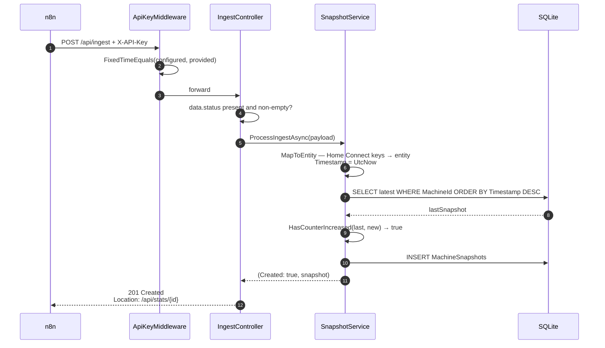
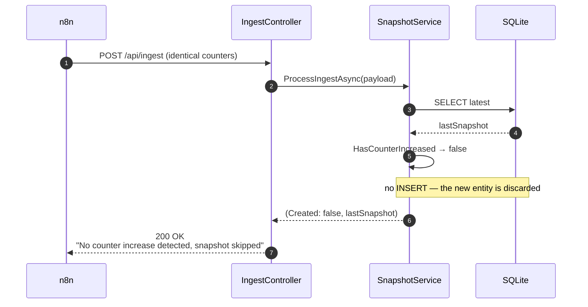
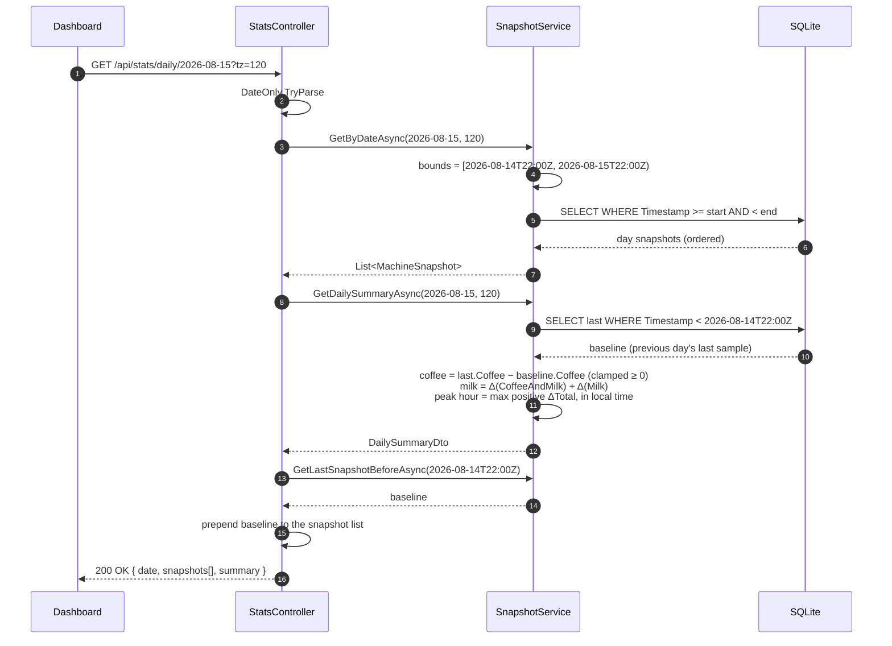
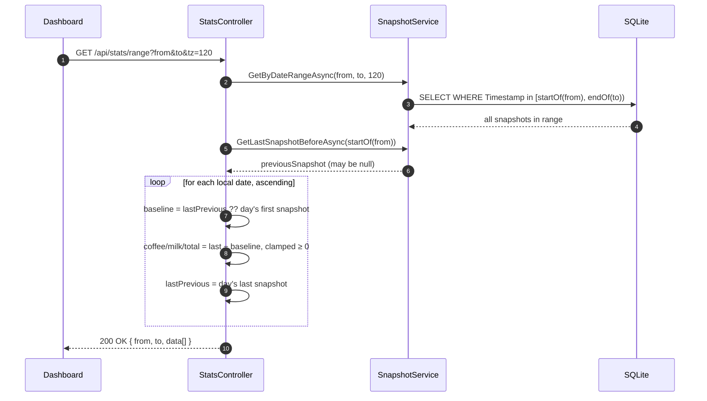
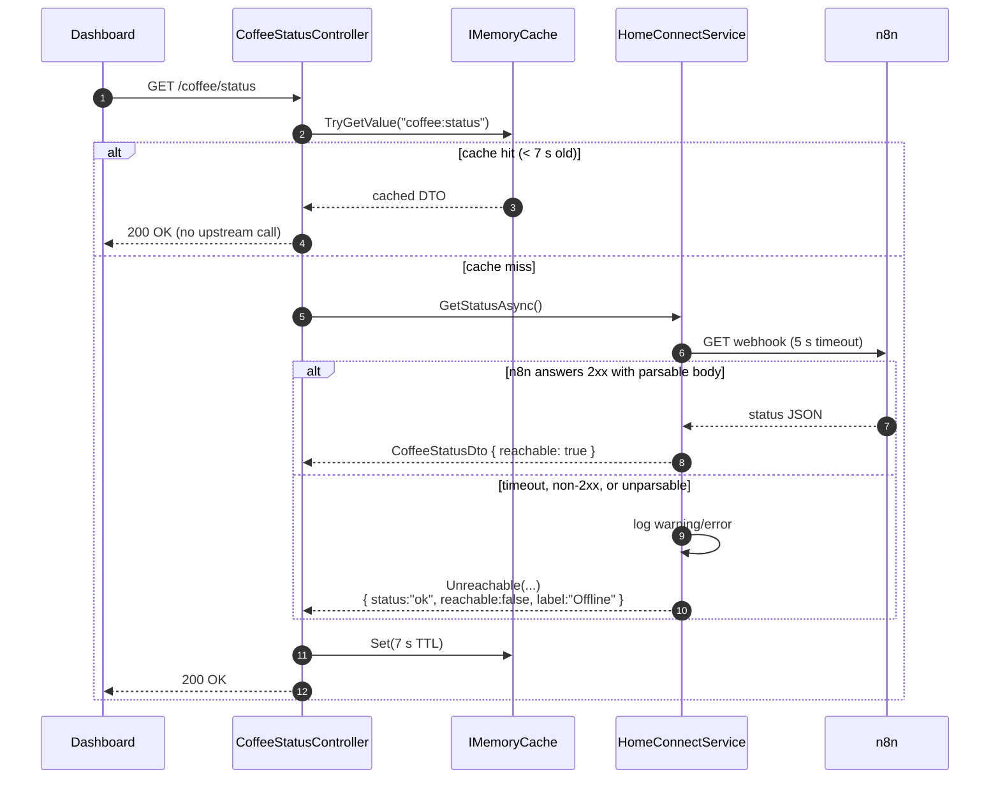

# 6. Runtime View

Six scenarios, chosen because each one exercises a rule that is not obvious
from the static structure.

## 6.1 Ingest — new counter reading



## 6.2 Ingest — unchanged counters (the common case)

Roughly 90 % of ingest calls take this path: n8n polls every 15 minutes, but
nobody makes coffee at 15-minute intervals all day.



The response carries the **existing** snapshot's id and timestamp, not the
discarded one. That is what makes retries safe: n8n replaying the same payload
five times gets the same 200 and the same id every time.

## 6.3 Daily statistics — cross-day baseline

The scenario that justifies the whole baseline mechanism. Request:
`GET /api/stats/daily/2026-08-15?tz=120` (CEST).



Why the baseline is returned in the list as well as folded into the summary:
the frontend computes its own per-hour deltas for `HourlyPeaksChart`, and
without a leading element the first hour of the day would show no consumption.

**Edge case — no snapshots at all for the day:** `GetDailySummaryAsync`
returns a zeroed DTO immediately, and the controller returns an empty
`snapshots` array (the baseline is only prepended when the day has data).

## 6.4 Range statistics — rolling baseline

`GET /api/stats/range?from=2026-08-10&to=2026-08-16&tz=120`



Two consequences worth knowing:

- **Days without any snapshot do not appear in `data[]`.** They are absent,
  not zero. The frontend must not assume a contiguous series.
- The aggregation loop runs **in the controller**, not in a service. It is a
  documented deviation from the layering ([11](11-risks.md)) and it duplicates
  the delta arithmetic that already exists in `GetDailySummaryAsync`.

## 6.5 Power control and status refresh

```mermaid
sequenceDiagram
    autonumber
    participant U as User
    participant D as Dashboard
    participant PC as PowerController
    participant HC as HomeConnectService
    participant N as n8n
    participant BSH as Home Connect

    U->>D: click power button
    D->>D: coffeeAllowed()? — 07:00–18:00 Europe/Berlin
    Note over D: outside the window the button is disabled;<br/>the API itself does not check
    D->>PC: POST /coffee/power { state: "on" }
    PC->>PC: state ∈ {"on","off"}?
    PC->>HC: SetPowerStateAsync(true)
    HC->>N: PUT webhook { state: "on" } + Basic auth
    N->>BSH: PUT settings/BSH.Common.Setting.PowerState
    BSH-->>N: 204
    N-->>HC: 200
    HC-->>PC: (EnsureSuccessStatusCode passed)
    PC-->>D: 200 OK { status: "ok", state: "on" }
    D->>D: setTimeout 3 s — let BSH settle
    D->>D: invalidateQueries(['coffee','status'])
    D->>PC: GET /coffee/status
```

Failure path: any non-2xx from n8n makes `EnsureSuccessStatusCode` throw; the
controller logs it and returns 500 with a generic message. The machine's real
state is then unknown to the dashboard until the next status read.

## 6.6 Status read with cache and graceful degradation



The endpoint never returns a 5xx. `reachable: false` is a normal, cacheable
answer — which also means an outage is cached for 7 seconds, deliberately.

## 6.7 Startup and migration

```mermaid
sequenceDiagram
    autonumber
    participant P as Program.Main
    participant MB as MigrationBaseliner
    participant DB as SQLite

    P->>P: SENTRY_DSN set? → UseSentry
    P->>P: load appsettings.Secrets.json (optional)
    P->>P: register DbContext, services, HttpClient, MemoryCache, CORS
    P->>MB: EnsureBaselined(db, logger)
    MB->>DB: does MachineSnapshots exist?
    alt no — fresh database
        MB-->>P: return (Migrate will create everything)
    else yes
        MB->>DB: does __EFMigrationsHistory exist?
        alt yes — already baselined
            MB-->>P: return
        else no — legacy EnsureCreated database
            MB->>DB: BEGIN; CREATE TABLE __EFMigrationsHistory;<br/>INSERT initial migration id; COMMIT
            MB-->>P: baselined
        end
    end
    P->>DB: Database.Migrate() — apply pending only
    P->>P: UseForwardedHeaders (if configured),<br/>MapOpenApi + MapScalarApiReference (Development only),<br/>UseCors, UseRateLimiter, UseApiKeyAuthentication,<br/>MapControllers
    P->>P: Run()
```

A failing migration aborts startup rather than serving requests against a
wrong schema.

Configuration, by contrast, is **not** validated at startup:
`HomeConnectService` is a typed `HttpClient` registration and is therefore
constructed per request, so a missing `N8n:PowerWebhookUrl` surfaces as a 500
on the first `/coffee/*` call rather than as a startup failure. Recorded in
[11](11-risks.md).
