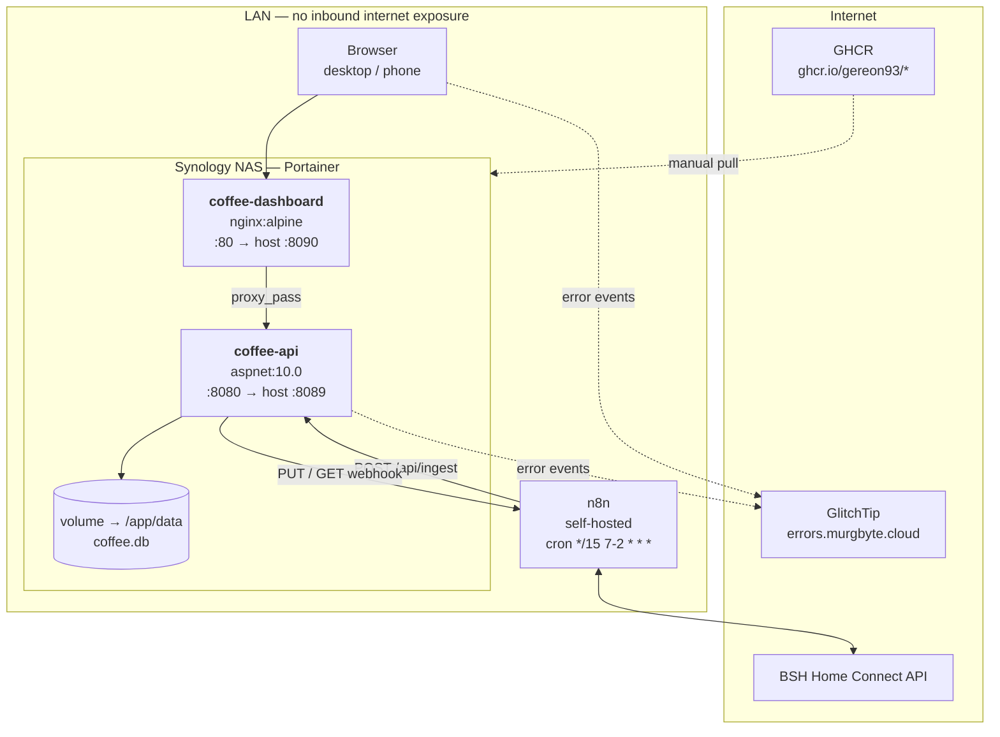
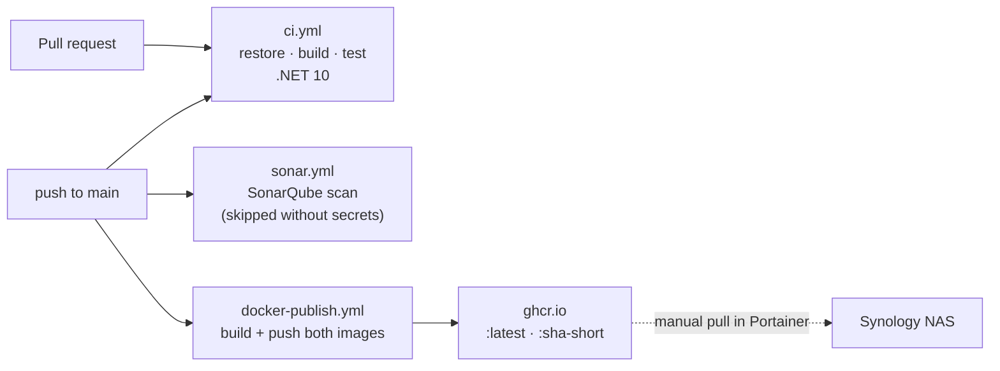

# 7. Deployment View

## 7.1 Infrastructure Overview



**Design intent:** the NAS has no inbound internet exposure. n8n is the only
component with outbound internet access, and it is also the only holder of BSH
OAuth2 credentials. This is what makes the unauthenticated read and power
endpoints tolerable — see [08.4](08-concepts.md#84-security) for the residual
risk that framing does *not* cover.

## 7.2 Container: coffee-api

| Property | Value |
|----------|-------|
| Build context | `./CoffeeApi` (`Dockerfile`, multi-stage: sdk:10.0 → aspnet:10.0) |
| Image | `ghcr.io/gereon93/coffee-api:latest` and `:sha-<short>` |
| Listen | `ASPNETCORE_URLS=http://+:8080`, published on host `:8089` |
| Volume | `/app/data` — persists `coffee.db` across container replacement |
| Health | `GET /api/health` → `{ status, timestamp, database, lastSnapshot }` |

### Configuration

Configuration comes from `appsettings.json`, the optional gitignored
`appsettings.Secrets.json`, and environment variables (last wins). Double
underscore maps to the configuration separator: `ConnectionStrings__Default`.

| Key / variable | Purpose | Behaviour when unset |
|----------------|---------|----------------------|
| `ConnectionStrings__Default` | SQLite path | Falls back to `Data Source=coffee.db` in the working directory. The Dockerfile sets `/app/data/coffee.db`. |
| `ApiKey` | Shared secret for `POST /api/ingest` | **Ingest becomes unauthenticated**; a warning is logged per request |
| `N8n__PowerWebhookUrl` | Power/status webhook | `HomeConnectService` throws on construction → 500 on the first `/coffee/*` request |
| `N8n__BasicAuthUser` / `N8n__BasicAuthPassword` | Webhook credentials | No `Authorization` header is sent |
| `SENTRY_DSN` | Error tracking endpoint | Sentry is not initialised at all |
| `SENTRY_ENVIRONMENT` | Environment tag | Falls back to `ASPNETCORE_ENVIRONMENT` |
| `SENTRY_RELEASE` | Release tag | `"dev"` |
| `SENTRY_TRACES_SAMPLE_RATE` | Tracing sample rate, invariant-culture float | `0.0` |
| `ASPNETCORE_ENVIRONMENT` | Environment name | Set to `Production` in the image |

> `.env.example` in `CoffeeApi/` documents the expected variables. Real values
> belong in Portainer's environment configuration or
> `appsettings.Secrets.json`, never in the repository.

## 7.3 Container: coffee-dashboard

| Property | Value |
|----------|-------|
| Build context | `./coffee-dashboard` (node:22-alpine build → nginx:alpine) |
| Image | `ghcr.io/gereon93/coffee-dashboard:latest` and `:sha-<short>` |
| Listen | `:80`, published on host `:8090` |
| SPA routing | `try_files $uri $uri/ /index.html` |
| Reverse proxy | `/api/`, `/coffee/`, `/scalar/`, `/openapi/` → `http://coffee-api:8080` |
| Static caching | `/assets/` → `expires 1y`, `Cache-Control: public, immutable` |

Because the dashboard proxies the API under the same origin, the browser never
performs a cross-origin request in production and `VITE_API_BASE_URL` stays
empty.

### Build-time variables

Vite inlines `VITE_*` variables into the bundle at **build** time — they are
public, so only non-secret values belong here (a Sentry DSN is designed to be
public).

| Build arg | Effect |
|-----------|--------|
| `BUILD_COMMIT` | Fallback for `__BUILD_COMMIT__` when git is unavailable inside the build |
| `VITE_SENTRY_DSN` | Enables frontend error tracking; empty disables it |
| `VITE_SENTRY_ENVIRONMENT` | Environment tag, defaults to Vite's `MODE` |
| `VITE_SENTRY_RELEASE` | Release tag, defaults to `__BUILD_COMMIT__` |
| `VITE_SENTRY_TRACES_SAMPLE_RATE` | Tracing sample rate, defaults to `0` |

`vite.config.ts` also defines `__BUILD_TIME__`, formatted in
`Europe/Berlin` — meaning the timestamp shown in the UI reflects the build
host's clock rendered in Berlin time.

## 7.4 Local Development

```bash
dotnet build Coffee.sln -c Release   # build everything
dotnet test CoffeeTest/              # 87 tests
cd CoffeeApi && dotnet run           # API + Scalar UI at /scalar/v1
cd coffee-dashboard && npm run dev    # dashboard on :5173
```

The Vite dev server proxies `/api` to `http://localhost:8089`, overridable via
`VITE_API_PROXY_TARGET`.

> The dev proxy covers **only** `/api`. `/coffee/status` and `/coffee/power`
> are not proxied, so the power button and live status do not work under
> `npm run dev` without extra configuration. Recorded in [11](11-risks.md).

## 7.5 CI/CD



| Workflow | Trigger | Does |
|----------|---------|------|
| `ci.yml` | push to `main`/`dev`, every PR | `dotnet restore` → `build -c Release` → `dotnet test` |
| `sonar.yml` | push to `main` | SonarQube scan. No-ops without `SONAR_HOST_URL` + `SONAR_TOKEN` |
| `docker-publish.yml` | push to `main`, manual | Matrix build of both images, push to GHCR with GitHub Actions layer cache |

Dependabot keeps npm and NuGet dependencies current; recent history shows
regular automated dependency PRs.

> **Gap:** no workflow runs `npm ci`, `npm run build`, `tsc`, or `npm run
> lint`. Frontend changes — including automated dependency bumps — reach
> `main` without any automated verification. Recorded in
> [11](11-risks.md).

### Manual image build

`build.sh` provides the same build outside CI, using Podman by default:

```bash
./build.sh api             # build + push coffee-api
./build.sh dashboard       # build + push coffee-dashboard
./build.sh all             # both
./build.sh api --no-push   # build only
DOCKER=docker ./build.sh all
```

It tags `:latest` and a `:YYYYmmdd-HHMMSS` timestamp — a different tagging
scheme from CI's `:sha-<short>`.

## 7.6 Operations

| Task | Procedure |
|------|-----------|
| **Deploy** | Portainer: pull the new image, recreate the container. The volume survives; migrations apply on startup. |
| **Backup** | Stop the API container (SQLite is single-writer), copy `coffee.db` from the volume, restart. |
| **Restore** | Replace the file and restart; `MigrationBaseliner` handles a pre-migration file. |
| **Health check** | `curl http://<NAS-IP>:8089/api/health` — `lastSnapshot` far in the past means the n8n workflow, not the API, is broken. |
| **Log inspection** | `docker logs coffee-api` — structured logs including skipped-snapshot debug lines and API-key warnings. |
| **Error triage** | GlitchTip, tagged `service=coffee-api` / `service=coffee-dashboard`. |
| **API exploration** | `http://<NAS-IP>:8090/scalar/v1`. |

> Scalar and the raw OpenAPI document are proxied and reachable by anyone on
> the LAN, in production, without authentication. Intentional for a LAN-only
> deployment; worth knowing before the deployment model changes.

## 7.7 Mapping Building Blocks to Infrastructure

| Building block | Artifact | Runs on |
|----------------|----------|---------|
| CoffeeApi | `ghcr.io/gereon93/coffee-api` | Docker container, Synology NAS |
| coffee-dashboard | `ghcr.io/gereon93/coffee-dashboard` | Docker container, Synology NAS |
| SQLite database | `/app/data/coffee.db` | Docker volume on the NAS |
| n8n workflow | External n8n instance | Self-hosted, internet-connected |
| CoffeeTest | Not deployed | GitHub Actions runner |
| CI/CD | GitHub Actions | GitHub-hosted |
| Error tracking | GlitchTip | Self-hosted |
