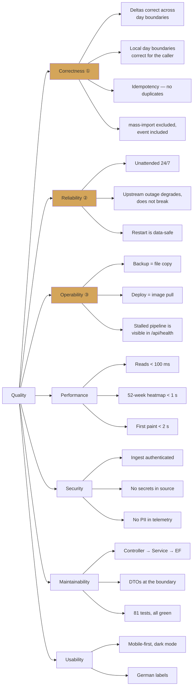

# 10. Quality Requirements

## 10.1 Quality Tree

① ② ③ are the top-priority goals from [01.4](01-introduction.md#14-quality-goals).

## 10.2 Quality Scenarios

Each row is a stimulus with a measurable response. "Covered by" names the test
that pins the behaviour, or states that it is unverified.

### Correctness

| # | Stimulus | Required response | Covered by |
|---|----------|------------------|------------|
| Q-1 | Three coffees are brewed at 06:40; the first sample of the day arrives at 07:15 | They count against *that* day, using the previous day's last snapshot as baseline | `SnapshotServiceDailySummaryTests` |
| Q-2 | Client sends `tz=120` (CEST) for `2026-08-15` | Query window is `[2026-08-14T22:00Z, 2026-08-15T22:00Z)` | `SnapshotServiceQueryTests` |
| Q-3 | A day in the requested range has no snapshots | The day is absent from `data[]` — not present with zeros | `StatsControllerTests` |
| Q-4 | A day is marked `mass-import` | Its deltas are excluded from heatmap buckets and from anomaly statistics | `SnapshotServiceHeatmapTests` |
| Q-5 | A day is marked `event` | It stays fully in all statistics and is annotated in the chart | `MarkedDaysControllerTests` |
| Q-6 | Snapshot has 5 coffee, 3 coffee+milk, 2 milk, 1 hot-water cup, 500 ml hot water | `TotalBeverages == 11` — millilitres excluded | `MachineSnapshotTests` |
| Q-7 | Heatmap groups a Sunday sample | `dayOfWeek == 7`, ISO-8601 style | `SnapshotServiceHeatmapTests` |
| Q-8 | A 52-week heatmap is requested during CEST and spans the CET period | **Known deviation:** winter samples are shifted by one hour. Accepted, see [ADR-004](09-design.md#adr-004-client-driven-timezone-offset) | not covered |

### Reliability

| # | Stimulus | Required response | Covered by |
|---|----------|------------------|------------|
| Q-9 | n8n delivers the identical payload three times | One row; responses `201`, `200`, `200`, all carrying the same snapshot id | `SnapshotServiceIdempotencyTests`, `IngestControllerTests` |
| Q-10 | n8n does not answer the status webhook within 5 s | `200 OK` with `reachable: false`, `label: "Offline"`; no exception surfaces | `HomeConnectServiceTests` |
| Q-11 | n8n rejects a power command | `500` with a generic message; the exception is logged and reported to GlitchTip | `PowerControllerTests` |
| Q-12 | Container restarts against an existing pre-migration database | `MigrationBaseliner` seeds the history; only pending migrations apply; no data loss | `MigrationBaselinerTests` |
| Q-13 | Ingest arrives with an empty `data.status` | `400` with `{ error, details[] }`; nothing written | `IngestControllerTests` |
| Q-14 | Database file is unreachable | `/api/health` reports `database: "disconnected"` | `ApiIntegrationTests` |
| Q-15 | The machine's counters reset to 0 after maintenance | **Known deviation:** treated as "no increase", not stored; deltas clamp to 0 until counters pass the old maximum | [11](11-risks.md) |

### Security

| # | Stimulus | Required response | Covered by |
|---|----------|------------------|------------|
| Q-16 | `POST /api/ingest` without `X-API-Key`, with a key configured | `401`; the attempt is logged with the remote address | `ApiIntegrationTests` |
| Q-17 | `POST /api/ingest` with a wrong key | `401`; comparison is constant-time | `ApiIntegrationTests` |
| Q-18 | An unexpected exception occurs in a controller | The response body contains no exception message, stack trace, or internal path | controller tests |
| Q-19 | `ApiKey` is not configured | **Known deviation:** the request is forwarded with a warning; ingest is effectively unauthenticated | [11](11-risks.md) |
| Q-20 | A third-party website open in a LAN browser posts to `/coffee/power` | **Known deviation:** `AllowAnyOrigin()` permits it; the machine switches on | [11](11-risks.md) |

### Performance

| # | Stimulus | Target | Status |
|---|----------|--------|--------|
| Q-21 | `GET /api/stats/daily/{date}` at typical volume (~76 rows/day) | < 100 ms server-side | not measured |
| Q-22 | `GET /api/stats/heatmap?weeks=52` (~28 000 rows) | < 1 s | not measured |
| Q-23 | Dashboard first contentful paint on LAN | < 2 s | not measured |
| Q-24 | Repeated `GET /coffee/status` within 7 s | Exactly one upstream call | `CoffeeStatusControllerTests` |

Performance targets are stated as intent, not as verified facts. There is no
load test and no benchmark in the repository; at the present data volume the
targets are comfortable, and the honest statement is that they are unmeasured.

### Maintainability

| # | Stimulus | Required response | Status |
|---|----------|------------------|--------|
| Q-25 | A new behaviour is added to a service | It ships with unit tests in the same change | Convention (`CLAUDE.md`), review-enforced |
| Q-26 | A behaviour crosses a boundary (DB, HTTP) | It ships with an integration test as well | Convention (`AGENTS.md`) |
| Q-27 | The full suite is run | 81 tests pass in under a second | Verified |
| Q-28 | A frontend change is pushed | **Gap:** no CI job builds, type-checks, or lints the frontend | [11](11-risks.md) |
| Q-29 | A dependency with a known vulnerability enters the graph | **Gap:** `NU1903` is emitted as a warning; nothing fails the build | [11](11-risks.md) |

### Usability

| # | Stimulus | Required response |
|---|----------|------------------|
| Q-30 | The dashboard is opened on a phone | Layout reflows; charts remain readable |
| Q-31 | The OS is in dark mode | The dashboard renders its dark palette |
| Q-32 | A user clicks a bar in the daily chart | The annotation modal opens for that date, pre-filled if already annotated |
| Q-33 | The power button is used at 19:00 Berlin time | It is disabled; the machine is not switched |
| Q-34 | A data region is loading or has failed | A spinner or an error message is shown for that region only, not the whole page |
